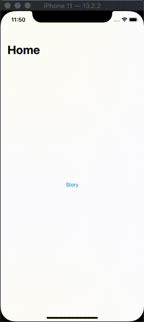

# UIStoryView


[](uistoryview-video.gif)

## Installation

UIStoryView supports swift 5.0, iOS 10

1. Add pod ‘UIStoryView’
2. Install the pods by running pod install.
3. Add import UIStoryView in the .swift files where you want to use it.


## Basic Usage


```swift
let storiesViewController = StoriesBuilder(yourStorySectionModels)
      .setTrackTintColor(color: UIColor.black.withAlphaComponent(0.16))  // Optional
      .setProgressTintColor(color: UIColor.white) // Optional
      .build();

self.present(storiesViewController, animated: true, completion: nil);

```
### Caveats

`yourStorySectionModels` has to conform `IStorySection` protocol.

### Dependencies
 UIStoryView uses `SDWebImage`
 
### References
 
Cube animation was partly taken from [oyvinddd/ohcubeview](https://github.com/oyvinddd/ohcubeview).
